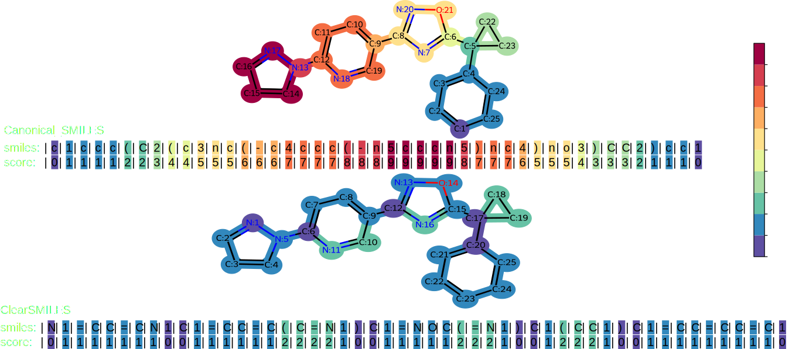

# ClearSMILES

ClearSMILES is a data augmentation procedure for SMILES. The first goal of CLearSMILES is to minimize the dimensionality of SMILES, i.e., reducing the size of the vocabulary needed to describe a dataset. The second goal of ClearSMILES is to reduce the attention effort a machine learning model has to make to process a SMILES.



## How to install ClearSMILES

First, clone the repository:

To install the python dependencies, you can create a virtual env:

```bash
# Create and activate virtual environment
python3 -m venv venv
source venv/bin/activate

# Install dependencies
pip install -r requirements.txt
pip install -e .

# Test the installation
pytest src/test/download_test.py
```

## Running ClearSMILES on SLURM clusters

ClearSMILES is a stochastic data augmentation procedure. Therefore, it is not possible to guarantee that it will always yield the same results. However, by generating a very large number of SMILES (default: 100k randomized SMILES per molecule), the results should be consistent. As random search is time-consuming, the ClearSMILES generation process is designed for cluster parallelization. Here's an example SLURM job:

```bash
#!/bin/sh
#SBATCH --time=01:00:00
#SBATCH --job-name=ClearSMILES_gen
#SBATCH --output=logs/ClearSMILES_gen/out_%A_%a.log
#SBATCH --error=logs/ClearSMILES_gen/err_%A_%a.log
#SBATCH --cpus-per-task=4
#SBATCH --mem=4G
```

## How to download MOSES dataset

The MOSES dataset can be downloaded using:

```bash
# Download MOSES dataset
python src/data/download_MOSES.py

# Verify dataset integrity
pytest src/test/download_test.py
```

This will download the MOSES dataset to `data/raw/MOSES.csv`. The dataset contains around 2M molecules with their SMILES representation. The download script will also verify the integrity of the downloaded files.

## How to generate ClearSMILES for MOSES

ClearSMILES is a stochastic data augmentation procedure. Therefore, it is not possible to guarantee that it will always yield the same results. However, by generating a very large number of SMILES (default: 100k randomized SMILES per molecule), the results should be consistent. As random search is time-consuming, the ClearSMILES generation process is designed for cluster parallelization.

```bash
python src/features/concatenate2lib.py \
  --search_pattern data/interim/ClearSMILES_MOSES_subset_*.parquet \
  --output_filepath data/processed/whole_MOSES_ClearSMILES_results.parquet
```

You can enable multiprocessing with the `--use_multiprocessing` flag.

## ClearSMILES property analysis results

To analyze ClearSMILES properties:

- Use `ClearSMILES_analysis.ipynb` for general analysis
- Use `memory_score.ipynb` to project semantic maps on 2D structures

## Aggregating data and relaunching failed jobs

First, you need to check if all the jobs have successfully completed using:
When all the tasks are completed, you aggregate all the data to a single file using:
First, check if all jobs have completed successfully:

```bash
python src/features/get_failed_gen_tasks.py \
  --search_pattern data/interim/ClearSMILES_MOSES_subset_*.parquet \
  --output_filepath data/external/failed_task_id.txt \
  --job_array_range 1-2000
```

Adjust the search pattern for custom datasets. If successful, you'll see: 'all tasks were successfully completed, no file will be written'. Otherwise, you'll get a success rate and failed task IDs in the output file.

To relaunch failed jobs, modify the SLURM array range parameter:

```bash
# Example: Change from
#SBATCH --array=1-2000
# to
#SBATCH --array=3,15,42,1457
```

When complete, aggregate the data:

```bash
python src/features/concatenate2lib.py \
  --search_pattern data/interim/ClearSMILES_MOSES_subset_*.parquet \
  --output_filepath data/processed/whole_MOSES_ClearSMILES_results.parquet
```

You can use multiprocessing to read the file with the `--use_multiprocessing` flag.

## ClearSMILES property analysis

To analyze ClearSMILES properties:

- Use `ClearSMILES_analysis.ipynb` for general analysis
- Use `memory_score.ipynb` to project semantic maps on 2D structures

---
*Project based on the [cookiecutter data science project template](https://drivendata.github.io/cookiecutter-data-science/). #cookiecutterdatascience*
